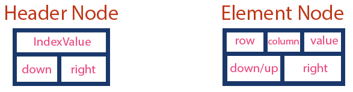
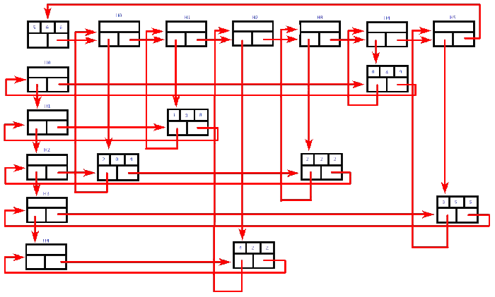

# CSC212-final-project

<h2>Assignment:</h2>
<ul>
  <li>Load sparse matrices from files</li>
  <li>Design a class for representing a matrix using linked lists</li>
  <li>memory efficient</li>
  <li>Implement at least matrix addition and matrix multiplication</li>
</ul>

<h2>Deliverables include:</h2>
<ul>
  <li>source code submitted (Gradescope)</li>
  <li>project report (Gradescope)</li>
  <li>class presentation (max 10mins) (Zoom)</li>
</ul>

<h2>Grading:</h2>
<ul>
  <li>Source Code (20%)</li>
  <li>Presentation (40%)</li>
  <li>Project Report (40%)</li>
</ul>

  <strong>Outstanding projects may be granted a straight A as the
final grade for CSC 212</strong>
  (decided by invited judges)

...

...

...

from <a href=http://www.btechsmartclass.com/data_structures/sparse-matrix.html#:~:text=Sparse%20matrix%20is%20a%20matrix,only%2010%20non%2Dzero%20elements.>
  btechsmartclass.com
  </a>

                     
<h2>What is Sparse Matrix?</h2>
                        

In computer programming, a matrix can be defined with a 2-dimensional array. Any array with 'm' columns and 'n' rows represent a m X n matrix. There may be a situation in which a matrix contains more number of ZERO values than NON-ZERO values. Such matrix is known as sparse matrix.

                        

<strong>Sparse matrix is a matrix which contains very few non-zero elements.</strong>

When a sparse matrix is represented with a 2-dimensional array, we waste a lot of space to represent that matrix. For example, consider a matrix of size 100 X 100 containing only 10 non-zero elements. In this matrix, only 10 spaces are filled with non-zero values and remaining spaces of the matrix are filled with zero. That means, totally we allocate 100 X 100 X 2 = 20000 bytes of space to store this integer matrix. And to access these 10 non-zero elements we have to make scanning for 10000 times. To make it simple we use the following sparse matrix representation. 

                        
<h4>Sparse Matrix Representations</h4>
                        

A sparse matrix can be represented by using TWO representations, those are as follows...

                        
<ol>
  <li>Triplet Representation (Array Representation)</li>
  <li>Linked Representation</li>
</ol>

<h4>Linked Representation</h4>
                      
                      
                      

In linked representation, we use a linked list data structure to represent a sparse matrix. In this linked list, we use two different nodes namely <strong>header node</strong> and <strong>element node</strong>. Header node consists of three fields and element node consists of five fields as shown in the image...

                                               

                        

Consider the above same sparse matrix used in the Triplet representation. This sparse matrix can be represented using linked representation as shown in the below image...

                        

                          

In the above representation, H0, H1,..., H5 indicates the header nodes which are used to represent indexes. Remaining nodes are used to represent non-zero elements in the matrix, except the very first node which is used to represent abstract information of the sparse matrix (i.e., It is a matrix of 5 X 6 with 6 non-zero elements).  In this representation, in each row and column, the last node right field points to its respective header node.

